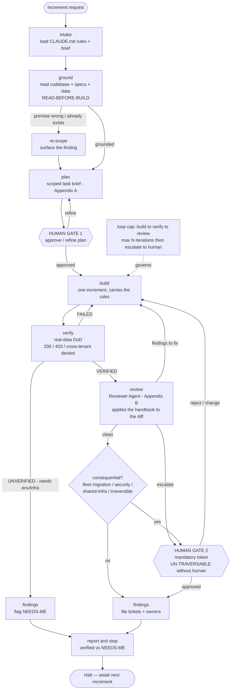
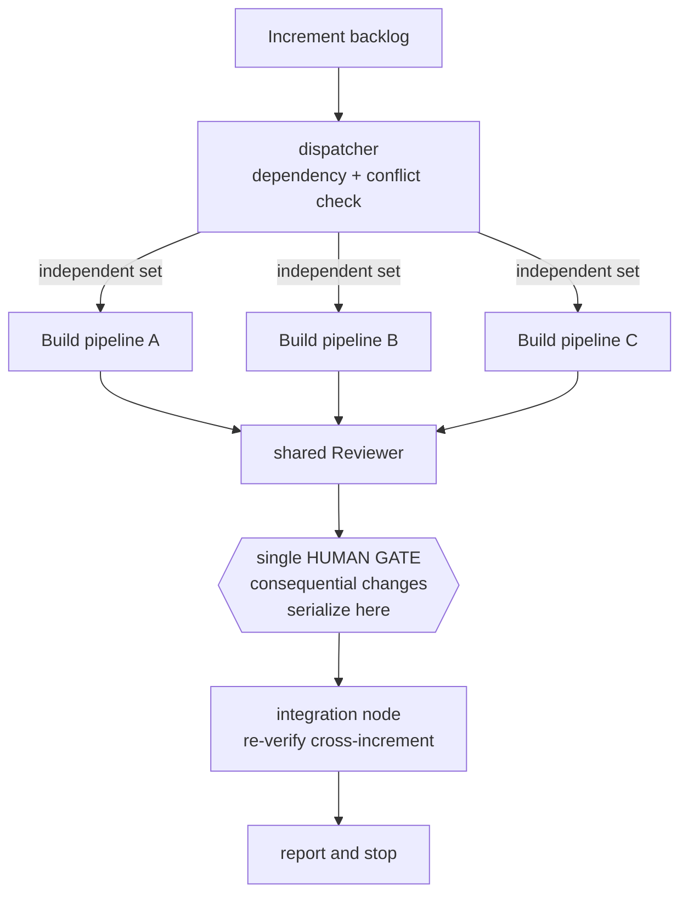

# The Build Graph — an agent workflow for shipping at scale

**What this is:** the *Agentic Build Handbook* turned into an executable agent graph for Claude Code. It encodes the discipline as a state machine so every increment runs the same way — grounded, built, verified, reviewed, gated — without depending on a human remembering the rules each time.

**The one design principle, above all others:**

> **Scale the breadth, never the risk. Parallelize the independent; serialize the consequential through a human.**
>
> You can run many build agents across many *independent* surfaces at once. But every irreversible change — fleet migrations, security models, shared-infra mutations — funnels through a single mandatory human gate, no matter how many agents are running. The graph gets you throughput; it never gets you an un-gated irreversible action.

A graph that removes the human gates to "run end to end" is not this graph. It is the exact failure mode the handbook exists to prevent — every disaster avoided in the reference build was caught *at a human gate*, not by an agent.

---

## The graph



**Read the graph as:** a single increment flows top to bottom. The two double-bordered nodes (`GATE 1`, `GATE 2`) are **hard human interrupts** — the graph *halts and waits for a human token*; it cannot self-traverse them. Everything else is agent-driven, with loops back to `build` when verification or review sends work back.

---

## State (what flows along the edges)

A single state object, carried and updated by every node:

```
BuildState {
  increment:      { id, goal, scope_in[], scope_out[], DoD[] }   // the brief
  rules:          CLAUDE.md ruleset (loaded at intake, immutable)
  grounding:      { files_read[], specs_read[], findings[], premise_ok }
  diff:           the changes produced by build
  verification:   { status: VERIFIED|UNVERIFIED|FAILED, evidence[], reason }
  review:         { verdict: CLEAN|FINDINGS|ESCALATE, findings[] }
  consequential:  bool + why   // fleet-migration | security | shared-infra | irreversible
  gates:          { plan_approved: token?, conseq_approved: token? }
  ledger:         findings filed (tickets, [NEEDS-ME], unowned-risk flags)
  iterations:     build↔verify↔review counter (for the loop cap)
}
```

The `gates.*` tokens are the safety kernel: a node that needs a gate reads the token and **refuses to proceed if it's absent**. A human writes the token out-of-band (approval). No agent can forge it.

---

## Node contracts

Each node is a Claude Code agent (or a deterministic step) with a fixed brief drawn from the handbook.

| Node | Role | Carries (handbook §) | Output |
|---|---|---|---|
| **intake** | Load the rules + the increment brief into context | The full CLAUDE.md ruleset | `rules`, `increment` |
| **ground** | Read the actual codebase, specs, data before anything | §3 Read-before-build | `grounding`; may set `premise_ok=false` → re-scope |
| **plan** | Produce the scoped task brief | Appendix A template, §11 scope | `increment` refined; scope_in/out, DoD |
| **build** | Execute exactly one increment | §4 increments, §9 reuse-don't-fork, §5 migrations, §6 security-per-surface | `diff` |
| **verify** | Prove real behaviour against a real system | §1 Definition of Done, §2 no-false-green | `verification` (VERIFIED / UNVERIFIED+reason / FAILED) |
| **review** | Apply the whole handbook to the diff | Appendix B Reviewer Agent | `review` (CLEAN / FINDINGS / ESCALATE) |
| **findings** | File tickets with severity + owner; flag [NEEDS-ME] | §8 surface-don't-bury | `ledger` |
| **report&stop** | State verified vs [NEEDS-ME]; halt | §1, §4 stop-and-report | halt |

**The two agents worth defining as first-class Claude Code subagents** are `build` and `review`. The rest can be steps in the orchestrator. The `review` subagent is the highest-value one — it *is* the gate discipline, applied to every diff automatically (see Handbook Appendix B for its standing brief).

---

## Edges & routing rules

- **ground → re-scope** when grounding finds the premise wrong (e.g. "this already exists") — carry the finding, don't build the wrong thing.
- **verify → build** on `FAILED` (fix and re-verify). **verify → findings** on `UNVERIFIED` that needs a human-provided environment/credential/infra ([NEEDS-ME]) — do not loop trying to verify something only a human can unblock.
- **review → build** on `FINDINGS` (fix them). **review → GATE 2** on `ESCALATE` (reviewer thinks a human must decide).
- **consequential? → GATE 2** whenever the diff touches: a fleet-running migration, an access-control / security model, shared or production-adjacent infrastructure, or anything irreversible. Otherwise → findings → report.
- **Loop cap:** `build↔verify↔review` is capped at N iterations (e.g. 3). On the cap, **escalate to a human** — never spin indefinitely; a stuck loop is a signal, not a state to grind in.

---

## The human gates — the non-negotiable kernel

Two nodes are structural human interrupts. They are the reason this graph is safe rather than reckless.

**GATE 1 — Plan approval.** Before any code is written, a human approves (or refines) the scoped plan. Cheap, and it catches mis-scoping before effort is spent.

**GATE 2 — Consequential-change approval.** Before any irreversible change lands, a human holds the token. This gate is **un-traversable by any agent**, including the reviewer agent. The reviewer *raises the floor* (catches what a tired human misses); the human gate *is the ceiling* (sign-off on the unrecoverable). Both exist; neither replaces the other.

**What must always hit GATE 2:**
- Fleet-running migrations (the highest blast radius — see Handbook §5)
- Access-control / RBAC / security models
- Any change to shared or production-adjacent infrastructure
- Anything irreversible (deletions, sends, publishes, config that affects live traffic)

Implementation must be a *durable* interrupt: the graph checkpoints its state, halts, and resumes only when a human writes the approval token. If your orchestration layer cannot pause-and-wait durably, **do not build the graph** — it will pressure you toward auto-approval, which defeats the purpose. (LangGraph's interrupt/checkpoint model supports this cleanly; a naive prompt-chain does not.)

---

## Scaling: parallelize the independent, serialize the consequential

This is how you get throughput without buying risk.



- **The unit that scales is the increment, not the agent.** Run the same disciplined pipeline over more increments.
- **The dispatcher fans out only genuinely independent increments** — no shared files, no shared migration, no dependency between them. A conflict/dependency check *gates* the fan-out; anything that overlaps runs serially. (This is why you split the reference build into a management track and an engine track — two independent tracks, not N autonomous agents on one surface.)
- **The reviewer and the human gate are shared serialization points.** Five build agents can work five independent surfaces in parallel; all five fleet-migrations still queue through the *one* human gate. Breadth parallelizes; risk serializes.
- **Fan-in re-verifies cross-increment.** Parallel increments that each passed alone must be re-checked together at the integration node — independent-in-isolation is not the same as safe-when-merged.

**What NOT to scale:** do not fan out many autonomous agents making *consequential* changes concurrently. That multiplies variance and dilutes the review that keeps it safe. More firepower does not solve an access-or-decision bottleneck — and the bottleneck is almost never build capacity (Handbook, The One Idea).

---

## Mapping to Claude Code

Claude Code is not itself a graph engine — so the graph is: **subagents + an orchestrator + the permission model.**

- **CLAUDE.md** (repo root) = the `rules` state, loaded at intake into every node. This is the handbook body as standing instructions.
- **Subagents** = the `build` and `review` nodes, defined as custom Claude Code agents with the briefs from Handbook Appendix A (build) and Appendix B (review).
- **Slash commands / task briefs** = the increment templates that seed `intake`.
- **The orchestrator** = one of:
  - the **Claude Agent SDK**, driving the state machine and invoking Claude Code per node (most control; cleanest human-interrupt support);
  - an external graph engine (**LangGraph**) whose nodes shell out to Claude Code (best if you already run LangGraph — durable interrupts out of the box);
  - a lightweight driving skill for small scale (fine for a single pipeline, weak on parallel fan-out and durable gates).
- **The human gates** = map to Claude Code's approval/permission prompts for the consequential tool calls (migrations, writes to shared infra, publishes) — set to **require confirmation**, never auto-approve, for the consequential change classes. This is where the graph's GATE 2 becomes real: the permission prompt *is* the token.

**Minimum viable version** (build this first): one pipeline, no parallel fan-out, with `build` + `review` as subagents and both human gates as required-confirmation permission prompts. Prove the single-track discipline works, *then* add the dispatcher and parallel pipelines. Do not start with the parallel version — a fan-out graph whose gates you haven't validated is the dangerous one.

---

## Is it good? The honest test

A build graph made from this handbook is **good** when:

- The two human gates are hard, durable interrupts — the graph *halts and waits*, structurally un-traversable without a human token.
- The `review` node genuinely applies the handbook and routes findings *back to build*, rather than rubber-stamping.
- `verify` returns honest `UNVERIFIED` states that **block** the "done" transition — no green-build shortcut.
- Parallelism is limited to genuinely independent increments; consequential changes serialize through the single human gate.
- It starts as one validated pipeline before scaling to many.

It is **bad** — actively worse than no graph — when:

- It runs increments to completion autonomously, self-approving past the consequential gates.
- It fans out many agents making irreversible changes concurrently.
- The reviewer node's approval is treated as a substitute for human sign-off on the unrecoverable.
- `verify` can be satisfied by a green build instead of real behaviour.

Build the first version. Prove the gates hold. Then scale the breadth — never the risk.
