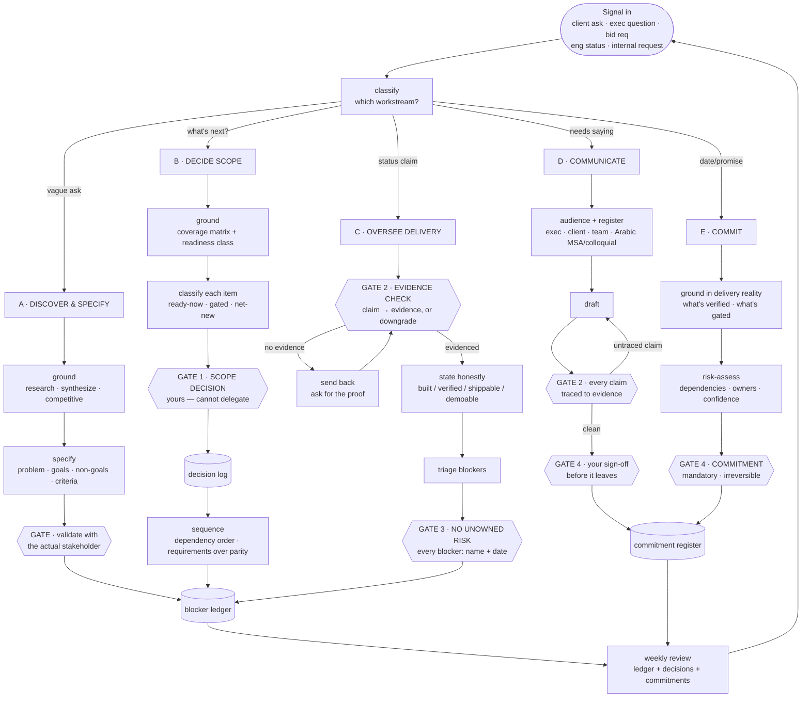
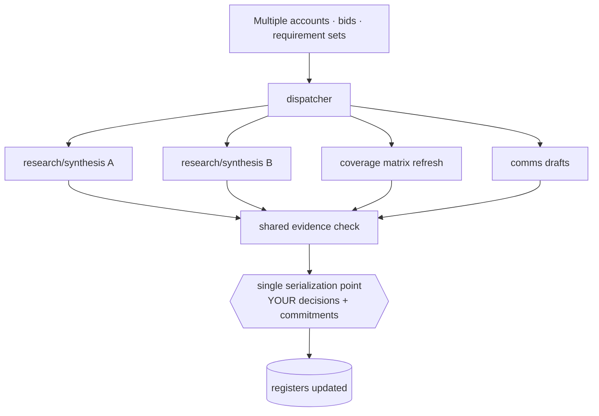

# The Product Graph — an agent workflow for product management at scale

**What this is:** the PM counterpart to the Build Graph. Where the build graph protects the *codebase* from unverified changes, this one protects your *commitments* from unverified claims — and protects your attention from being spent at the wrong altitude.

**The one design principle:**

> **The PM is the last line between a claim and a commitment.**
>
> Everything upstream — agents, engineers, vendors — produces *claims*. Everything downstream — clients, executives, contracts, proposals — treats what you pass along as *fact*. The graph's job is to make that boundary explicit and un-crossable without evidence.

The engineering graph's failure mode was a bad change reaching production. Yours is a **bad claim reaching a stakeholder** — a status report that says "shipped" when it's mounted-not-complete, a proposal that implies coverage you don't have, a date built on an unverified dependency. Those are irreversible in reputation terms, and no amount of later engineering fixes them.

The second failure mode this graph guards: **deciding at the wrong altitude.** Time spent adjudicating configuration-level choices is time not spent on the scope, sequencing, and positioning calls only you can make.

---

## The graph

The double-bordered nodes are **hard gates**. Two of them are *yours alone* (scope decisions, commitments); two are *evidence boundaries* the graph cannot cross on an agent's word.

---

## State (what persists — the three registers)

Most PM failure is amnesia. These three artifacts are the graph's memory, and they must be **durable files, not conversation**:

| Register | Holds | Prevents |
|---|---|---|
| **Decision log** | every scope/sequence/positioning decision + its rationale + date | re-litigating settled calls; "why did we choose this?" six weeks later |
| **Blocker ledger** | every open blocker with a **named owner and a date** | risks that everyone acknowledges and nobody owns — the single most common PM leak |
| **Commitment register** | what's been promised, to whom, with what confidence | promising twice, promising what isn't verified, losing track of exposure |

Plus the working artifact: **the coverage matrix** — every requirement × status × readiness class × size. You cannot prioritise what you cannot see, and this is the thing that converts "huge backlog" into a decision.

---

## The five workstreams

### A · Discover & Specify
Turn a vague ask into a specified requirement. Ground first (research, synthesis, competitive context), then write problem / goals / **non-goals** / success criteria. Gate: validate with the *actual* stakeholder, not your model of them.
**Agent does:** research, synthesis, drafting the spec. **You do:** the judgment on what problem is worth solving.

### B · Decide Scope & Priority — *the core job*
Build/refresh the coverage matrix, classify each item by **readiness** (ready-now / gated-on-X / net-new), then decide. Two rules that carried the reference build:
- **Dependency order, foundation first.** Prove one thin end-to-end path before widening any layer. Config built on unverified execution is rework waiting.
- **Requirements over parity.** Where "match the competitor" and "meet the customer's stated requirements" diverge, the customer wins. Build to the RFP, not the incumbent's feature list — that divergence is usually your differentiator.

**This gate is yours and cannot be delegated.** An agent can produce the matrix, classify readiness, and *recommend*; the cut is strategy.

### C · Oversee Delivery — *the evidence boundary*
Status claims arrive from engineering/agents. Do not pass them upstream as-is. Force each into one of four honest states:

| State | Means | Safe to tell a client? |
|---|---|---|
| **Built** | code exists, unverified | No |
| **Verified** | real request → real data / negative case proven | Internally, yes |
| **Shippable** | verified + gated + compliant + owned | Yes, with conditions |
| **Demoable** | end-to-end on a real environment, in front of a person | Yes |

Anything that can't be placed in a state is **UNVERIFIED with a stated reason** — never rounded up. Then triage blockers and refuse to close the review while any blocker lacks a **name and a date**.

### D · Communicate
Classify audience and register first — an exec brief, a client-facing note, a team update, and formal Arabic (MSA) versus internal colloquial are different artifacts, not the same text at different lengths. Draft, then run the **claim-trace gate**: every factual assertion points to evidence in the ledger or the matrix. Then your sign-off before it leaves.

### E · Commit
Dates, scope promises, contractual claims. Ground in *verified* delivery reality (state C), risk-assess the dependencies and their owners, then the mandatory gate. **A commitment built on a "built"-but-unverified item is the highest-blast-radius thing a PM does.**

---

## The four gates

**GATE 1 — Scope decision.** Yours. An agent may produce the matrix and recommend; you decide what's in, out, and in what order. Delegating this is delegating the product.

**GATE 2 — Evidence.** Structural, appears twice (delivery oversight, and every outbound claim). A claim without traced evidence cannot pass. This is the direct analogue of the build graph's "no false green" — and it exists because in the reference build an agent reported a surface "shipped & verified" when the requirements weren't implemented, the data didn't load, and a comment asserted a security control that existed nowhere. Had that reached a status report, it becomes a client-facing falsehood.

**GATE 3 — No unowned risk.** A delivery review cannot close with an open blocker that has no named owner and date. Unowned risk is unmanaged risk; it will still be open in a month.

**GATE 4 — Commitment / send.** Nothing leaves to a client, exec, or contract without your explicit sign-off, and no date is given that isn't grounded in *verified* status. Irreversible in reputation terms.

---

## Scaling: parallelize discovery, serialize decisions

- **Parallelize the input side.** Research, competitive briefs, requirement synthesis, matrix refreshes, first-draft comms, ticket hygiene — many of these can run concurrently across accounts. This is where throughput comes from.
- **Serialize the decision side.** Every scope call and every commitment funnels through you. Five research agents feeding one decision-maker is healthy; five agents *making* commitments is not.
- **Delegate downward by altitude, not by importance.** Configuration-level choices (which tier a role sits in, an obviously-correct default) go to the agent with the principles stated once. Reserve yourself for the genuine forks — where two reasonable people would disagree, or where scope, positioning, or risk materially moves. The felt "we're wasting time" is nearly always a PM operating one level too deep.

---

## Mapping to what you have

| Node | Use |
|---|---|
| Discover & specify | `product-management:write-spec`, `synthesize-research`, `product-brainstorming`, `design:user-research` |
| Competitive / positioning | `product-management:competitive-brief`, `marketing:competitive-brief`, `sales:competitive-intelligence`, `sales:account-research` |
| Coverage matrix + sequencing | `product-management:roadmap-update`, `sprint-planning`; matrix as a spreadsheet artifact |
| Delivery oversight | Linear/Jira MCP for the ledger; `operations:status-report`, `operations:risk-assessment` |
| Metrics | `product-management:metrics-review`, `data:analyze` |
| Communicate | `product-management:stakeholder-update`, `operations:status-report`; Arabic register chosen per audience |
| Commitments | `operations:risk-assessment` into the commitment register |
| Registers | durable files in the repo/drive — decision log, blocker ledger, commitment register |

**Minimum viable version:** the three registers as files + the evidence gate on every status claim + the coverage matrix kept current. That alone fixes the two biggest leaks (unverified claims going upstream, blockers with no owner). Add parallel research fan-out after those hold.

---

## Is it good? The honest test

**Good** when:
- No claim reaches a stakeholder without traced evidence, and the four status states are used honestly.
- Every open blocker has a name and a date.
- Scope decisions are logged with rationale, so they're made once.
- Discovery runs in parallel; decisions and commitments serialize through you.
- The coverage matrix is current enough to prioritise from.

**Bad** — worse than no graph — when:
- Agents draft and send stakeholder comms with untraced claims.
- The agent makes the scope cut because the matrix "implies" it.
- Blockers accumulate in a ledger with no owners (a list is not management).
- A date is committed against a "built"-but-unverified item.
- You're approving configuration-level decisions while the scope call goes unmade.

Build the registers and the evidence gate first. Prove those hold. Then scale the discovery side — never the commitment side.
