# The Product Graph — signal to handover

*Proposed 2026-08-01. Owner: MK.*

> **Status: UNVERIFIED.** No feature has been walked through this end-to-end. It is a proposal to trial on one feature, not policy. It becomes the standard when a feature enters at `signal`, exits at `handover`, and devs and QA start without asking a scoping question — not before. (Operating rule 1.)

**What this is:** the PM's own graph. Everything a product manager does, ending in a packet a developer and a QA engineer can pick up cold. **No node in it builds, tests, or ships code** — those belong to `/increment`, `qa-verify-spec`, and the Build Graph, and this document deliberately stops at their door.

**Relationship to what already exists:**

| Document | Owns |
| -- | -- |
| `PM_Agent_Graph_Spec.md` | *why* the gates exist and what they protect — the principles |
| `Agent_Graph_Spec.md` | the same, for the codebase |
| **this** | *which stage, which skill, which file, which gate* — the run |
| `ticket-format.md` | the shape of the brief and the story |
| `build-feature` skill | the machinery inside `discover` → `tickets` |

It does not restate the specs. Read those once; run this.

---

## The graph

```mermaid
flowchart LR
    SIG([signal]) --> DIS[discover]
    DIS --> FRM[frame]
    FRM --> SCP[decide scope]
    SCP --> BRF[brief]
    BRF --> PRO[prototype]
    PRO --> SLC[slice]
    SLC --> TKT[tickets]
    TKT --> HND{{HANDOVER}}
    HND --> DEV([devs and QA])

    DEV --> OVR[oversee claims]
    OVR --> COM[communicate]
    COM --> CMT[commit]
    CMT --> SIG

    FRM -.->|G0 worth building| SCP
    SCP -.->|G1 scope · yours| BRF
    OVR -.->|G2 evidence| COM
    OVR -.->|G3 owner + date| COM
    COM -.->|G4 sign-off| CMT

    PRO -.->|invalidates a requirement| BRF
    SLC -.->|surface with no owning story| BRF
    TKT -.->|no binary AC is writable| BRF
    HND -.->|restatement finds ambiguity| TKT
    OVR -.->|an AC failed| TKT
    COM -.->|a claim has no evidence| OVR
```



The left arm is **authoring** — it produces the packet. The right arm is **oversight** — it is what a PM does with what comes back, and it contains no code either. `devs and QA` is a single opaque node on purpose: this graph has no opinion about what happens inside it.

Dotted edges into `brief` and `tickets` are the **back-edges**. They already happen; today they get improvised or the run restarts. Naming them is most of what makes this a graph.

---

## Tiers — declared at `signal`, recorded in the ledger

A graph that demands discovery for a copy change gets routed around, and then it protects nothing.

| Tier | Enters at | Walks | Gates |
| -- | -- | -- | -- |
| **bug** | `oversee` | oversee → communicate | G2, G3 |
| **change** | `tickets` | tickets → handover → oversee → commit | G2, G3, G4 |
| **feature** | `signal` | the full walk | all four |

Anything that alters what a customer was promised is a **feature**, however small the diff. Tier is a judgement about the promise, never about the size.

---

## Running it

Two commands. `/signal` enters the graph once; `/stage` advances it, one stage per turn, until `handover`.

```
/signal "<the ask, in the words it arrived in>"   → tier, entry stage, ledger opened
/stage                                            → runs the current stage, writes back, stops
/stage                                            → …repeat
```

Every `/stage` turn opens with `doctor.sh` — repo freshness against the *canonical* branch, dirty trees, DNA age, and a false-green check that the current stage's artefact actually exists. It is read-only: it fetches, never checks out, never pulls. A FAIL stops grounding, because an absence observed in a stale tree is not evidence of absence.

Beyond that, `/stage` refuses to advance past a missing exit artefact, asks its stage's back-edge question before writing, and halts at G1 and G4 rather than recording them. After a `/clear`, `/stage` reads the ledger's **Now** block and picks up where the feature actually is — not where the transcript remembered it.

One stage per turn is the discipline, not a limitation. Two in a turn means a gate was crossed with nobody looking at it.

## Stages

| Stage | Runs | Exit artefact |
| -- | -- | -- |
| **signal** | `/signal` — classify, declare tier, open or resume the ledger, route | ledger opened, entry stage named |
| **discover** | `comp-search`; customer voice; `docs/codebase-dna.md` + `PROJECT_CONTEXT.md` for what is already true | `competitive-analysis.md`, grounding notes |
| **frame** | problem · goals · **non-goals** · success criteria, validated with the actual asker — not your model of them. Then **the question set** (what must this answer, per module, split by who asks) and **the viability check** (does anything already answer them?) | `questions.md` + `viability.md` — then **G0** |
| **decide scope** | coverage matrix; classify each item **ready-now / gated-on-X / net-new**; sequence by dependency, foundation first | **G1** · scope decision logged |
| **brief** | `ticket-format.md` §1 — ~700 words, the one journey diagram, **Surfaces touched** (changed *and* unchanged) | `features/<name>/brief.md` |
| **prototype** | build-feature Ph4 + the prototyping framework; this is where the copy lives, in both languages | `prototype.html`, `design-decisions.md` |
| **slice** | increments that each ship standalone value; every surface in the brief gets an owning story | increment plan |
| **tickets** | `ticket-format.md` §2–§5 — 150–250 words, numbered binary ACs, a negative per control | Linear parent + sub-issues |
| **handover** | the packet and its gate — below | packet complete |
| **oversee** | claims arrive from devs and QA; force each into a state; blockers get a name and a date | **G2**, **G3** |
| **communicate** | audience and register first; every assertion traced; release notes assemble from claims at `verified` or better | **G4** · status, notes, updates |
| **commit** | dates, scope promises, contractual claims, grounded only in `verified` | `docs/COMMITMENTS.md` |

`discover` through `tickets` is where `build-feature` already lives. This graph does not replace that skill — it says where it starts, where it stops, and what has to be true to leave it.

---

## Handover — the centre of this graph

The packet exists so that the first thing a developer does is build, and the first thing QA does is test — not ask what was meant. Everything before it in the graph is in service of this.

**Ready means all of it, for one story:**

*For the developer*
- [ ] **Brief linked**, and it holds the *why*, the locked decisions, the guardrails, and out-of-scope — so none of that is in the story
- [ ] **Prototype committed** under `features/<name>/`, and it is the single home of user-visible copy in EN + AR
- [ ] Every AC **numbered, binary, one requirement per line**
- [ ] **Estimate, priority, dependencies** set
- [ ] **"Anything not listed above is not decided. Ask before building — don't assume."** present
- [ ] **Surfaces touched** names what changes *and* what explicitly does not

*For QA*
- [ ] Every AC yields **one test case**, tickable without asking a question
- [ ] **Every control has its own negative AC** — unauthorised, over-limit, wrong workspace
- [ ] Any fallback or degradation AC is paired with its **threshold** AC, so some observation can fail the ticket
- [ ] The **coverage prompts** were answered — concurrency, isolation, permission revoked, dependency deleted, empty, Arabic and RTL, ceiling, who gets told, existing data
- [ ] **Coexistence** stated as an AC wherever the brief calls an adjacent surface unchanged
- [ ] Environment and fixtures point at the product's `qa-verify-spec` profile

**The gate:** handover is not a status change, it is a **countersignature.** Per `ticket-format.md` §6 the assignee posts a restatement — what I am building, what I read, what I am treating as out of scope, what looks ambiguous or wrong — *before any code*. Until that comment exists the ticket has been received, not accepted. An ambiguity raised there takes the back-edge to `tickets`, which costs minutes; found after an hour of generated code, it costs the increment.

---

## The five gates

Positions here; rationale in `PM_Agent_Graph_Spec.md`. **G0 was added 2026-08-02** — see *Lessons wired in*.

**G0 · Worth building — structural.** Leaving `frame`. Two artefacts must exist: the **question set** (what an owner and a manager actually need answered, per module) and the **viability check** (which of those questions the product already answers, read against the real branch). If most are already answered, **the feature stops here and that is a success, not a failure.** No prototype is drawn before this gate. Cost of the gate is under an hour; cost of skipping it is every stage downstream.

**G1 · Scope — yours, cannot be delegated.** Leaving `decide scope`. An agent builds the coverage matrix, classifies readiness, and recommends. The cut is strategy. Two rules that survive contact: **dependency order, foundation first** — prove one thin end-to-end path before widening any layer; and **requirements over parity** — where the competitor and the customer's stated requirement diverge, the customer wins.

**G2 · Evidence.** Inside `oversee`. Every claim from delivery lands in exactly one state — **built · verified · shippable · demoable** — or is marked **UNVERIFIED with a reason**. Never rounded up, never passed upstream as received. This is the boundary the whole graph exists to hold.

**G3 · No unowned risk.** Leaving `oversee`. The review does not close while any blocker lacks a **name and a date**. A list is not management.

**G4 · Sign-off.** Leaving `communicate`, and again at `commit`. Nothing reaches a customer, an exec, or a contract without yours — and no date is grounded in anything below `verified`.

G1 and G4 are yours alone. G2 and G3 are structural: the graph cannot cross them on an agent's word.

---

## Back-edges

| From | Condition | To |
| -- | -- | -- |
| prototype | a screen proves a stated requirement wrong | brief |
| slice | a surface in *Surfaces touched* has no owning story | brief |
| tickets | no binary AC can be written for it — the decision was never made | brief |
| handover | the restatement surfaces an ambiguity or a wrong assumption | tickets |
| oversee | an AC failed in verification | tickets |
| communicate | a claim has no evidence behind it | oversee |

Every traversal is logged in the ledger with its reason.

**Two traversals of the same edge — for any cause — is a stop, not a third attempt.** Go and fix the stage upstream before rebuilding. In the run that produced this rule, `prototype → brief` fired twice (wrong objective, then wrong organisation) and a third build was still rejected, this time on value. Three artefacts were discarded to learn something `frame` should have established in an hour. When the counter hits two, the next action is upstream repair, never another draft.

---

## Lessons wired in

*Added 2026-08-02, from the `operations-dashboard` run. Each rule below exists because something failed; none is precautionary.*

**L1 — Never put a closed set of options to the asker.** At `frame` the agent offered "navigation page or attention surface". The real answer was neither, it got locked as a decision, and three prototypes were built against it. **Whenever a stage puts a choice to a human, it must state what the options exclude and always offer "none of these".** A framing the agent invented is not a finding; a wrong one is expensive because it arrives wearing the authority of a question.

**L2 — Grounding constraints are binding until retired, not notes.** `grounding.md` found five module-scoped dashboards and warned a new one "would be the eighth". The direction then changed and the warning was never re-raised. **Every constraint grounding produces goes into the ledger and must be explicitly answered or retired by a later stage** — silence is not resolution.

**L3 — Ask what it must answer before drawing how it looks.** The artefact that finally made the decision possible was a list of the questions an admin and a manager need answered. It was written *after* three prototypes. It belongs at `frame`, and it is now a G0 exit artefact.

**L4 — "Already built elsewhere" is a first-hour question.** The viability check that killed the feature took well under an hour and could have run at `discover`. It is now G0 and blocks the prototype.

**L5 — For any data surface, the information bar is separate from the design bar.** `build-feature` Ph4's R1–R13 police fidelity to the design system and caught nothing here, because the prototype was faithful *and* worthless. A data surface additionally owes: **distributions, not means** (an average hides the tail that people complain about); **a reference for every number** — target, normal range, previous period, or peer rank, or the figure is uninterpretable; **time patterns** where load varies by hour or day; **ranked outliers**, computed rather than left for the reader to find in a table.

**L6 — Agree the craft benchmark before building, not after rejection.** Dense ops console, clean product analytics, or exec narrative are different products. Name the reference at `prototype` entry.

**L7 — State predictions before checking, and record them when they fail.** Before the viability read I predicted distributions and time patterns would be missing everywhere. Observer had them. Writing the prediction down first is what made it falsifiable; keeping the failed one in `viability.md` is what stops the next run trusting the same instinct.

## The spine — one ledger per feature

`features/<name>/ledger.md`.

It is an **index, not a store.** The registers already exist and remain the system of record; the ledger points at them and never copies:

| System of record | Ledger holds |
| -- | -- |
| `docs/DECISIONS.md` | the decision ID and a one-line summary |
| `docs/BLOCKERS.md` + Linear | the blocker ID, its owner, its date |
| `docs/COMMITMENTS.md` | what has been promised against this feature |
| `docs/COVERAGE.md` | what is verified |
| Linear | increment and story IDs |

What the ledger alone owns: **tier, current stage, gate verdicts with who and when, deliverable paths, back-edges taken, open grounding constraints (L2), and the claim table.** Read → advance one stage → write back. A fresh session reads it and knows exactly where the feature is. `docs/RESUME.md` does this for a session; nothing did it for a feature.

---

## What is not built yet

Stated plainly so it is not mistaken for coverage:

1. **Release notes assembly** — a note composes *many* ledgers, filtered to claims at `verified` or better. That many-to-one is the only place this graph is not a walk, and it is unbuilt.
2. **Nothing enforces any of it but you.** The gates are positions in a document, not code — the ledger records a verdict, it cannot withhold one.

Build the ledger and G2 first — the evidence boundary is where the irreversible damage happens. Prove them on one feature before touching anything else.

---

## Is it good? The honest test

**Good** when:

- Devs and QA start from the packet without a scoping question, and the restatement is posted before code.
- A feature's stage, tier, and gate verdicts survive a `/clear`, because they are in a file.
- No claim reaches a stakeholder at anything below `verified`, and the four states are used honestly.
- Every open blocker has a name and a date.
- Scope decisions are logged once, with rationale, and not relitigated three weeks later.
- Bugs enter at `oversee` and never walk the whole graph.

**Bad** — worse than no graph — when:

- The packet is marked ready while the copy, the negatives, or the threshold ACs are missing, and QA writes the missing criterion inside a bug report to have grounds to reject.
- The ledger duplicates `DECISIONS.md` or `BLOCKERS.md` and the two drift.
- An agent makes the scope cut because the matrix "implies" it.
- A date is committed against a `built`-but-unverified item.
- Anyone builds a runtime for this. It is a walk with four human gates; an executor around it is machinery pretending to be rigour.
